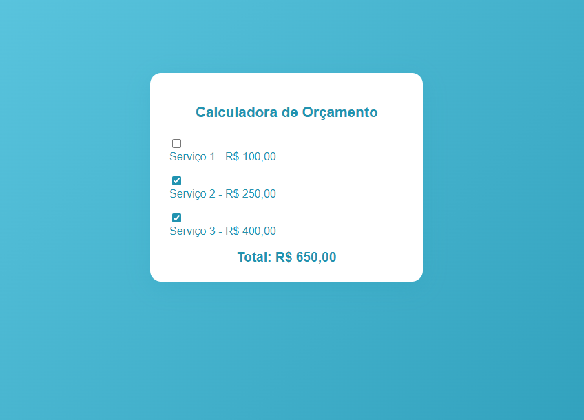

# Calculadora de Orçamento

Este projeto foi desenvolvido como parte de um desafio proposto pelo professor Luan. O objetivo é criar uma calculadora de orçamento simples e funcional para auxiliar no planejamento financeiro.

## Funcionalidades
- Interface intuitiva para cálculo de orçamento
- Fácil de usar e personalizar
- Demonstração visual do funcionamento

## Como usar
1. Abra o arquivo `calculadora.html` em seu navegador.
2. Preencha os campos conforme necessário para calcular seu orçamento.

## Demonstração
Veja abaixo uma imagem de demonstração do projeto:

## Autor
Victor Nascimento

## Desafio proposto pelo Prof. Luan.

